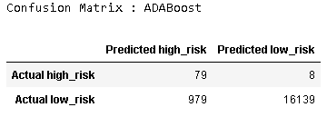

<!--
*** Thanks for checking out the Best-README-Template. If you have a suggestion
*** that would make this better, please fork the repo and create a pull request
*** or simply open an issue with the tag "enhancement".
*** Thanks again! Now go create something AMAZING! :D
-->

<!-- PROJECT SHIELDS -->
<!--
*** I'm using markdown "reference style" links for readability.
*** Reference links are enclosed in brackets [ ] instead of parentheses ( ).
*** See the bottom of this document for the declaration of the reference variables
*** for contributors-url, forks-url, etc. This is an optional, concise syntax you may use.
*** https://www.markdownguide.org/basic-syntax/#reference-style-links
-->

[![LinkedIn][linkedin-shield]][linkedin-url]

<!-- PROJECT LOGO -->

Deliverable 1: Use Resampling Models to Predict Credit Risk

Deliverable 2: Use the SMOTEENN Algorithm to Predict Credit Risk

Deliverable 3: Use Ensemble Classifiers to Predict Credit Risk

Deliverable 4: A Written Report on the Credit Risk Analysis (README.md)

<!-- 
TABLE OF CONTENTS

  
Table of Contents

  <ol>
    <li>
      <a href="#Overview"> Overview</a>
      <ul>
        <li><a href="#Subheader">Subheader</a></li>
      </ul>
    </li>
    <li>
      <a href="#Deliverable 1: Perform ETL on Amazon Product Reviews">Deliverable 1: Perform ETL on Amazon Product Reviews</a>
      <ul>
        <li><a href="#prerequisites">Subheader 1</a></li>
        <li><a href="#installation">Subheader 2</a></li>
      </ul>
    </li>
    <li><a href="#Deliverable 2: Determine Bias of Vine Reviews">Deliverable 2: Determine Bias of Vine Reviews</a></li>
    <!-- <li><a href="#roadmap">Roadmap</a></li> -->
  </ol>

 -->

<!-- ABOUT THE PROJECT -->
## Overview
Assignment goals: 
* Explain how a machine learning algorithm is used in data analytics.
* Create training and test groups from a given data set.
* Implement the logistic regression, decision tree, random forest, and support vector machine algorithms.
* Interpret the results of the logistic regression, decision tree, random forest, and support vector machine algorithms.
* Compare the advantages and disadvantages of each supervised learning algorithm.
* Determine which supervised learning algorithm is best used for a given data set or scenario.
* Use ensemble and resampling techniques to improve model performance.

## Deliverable 1:

RandomOverSampler and SMOTE algorithms, followed by the undersampling ClusterCentroids algorithm. We resampled the dataset, viewed the count of the target classes, trained a logistic regression classifier, calculated the balanced accuracy score, generated a confusion matrix, and generated a classification report.

#### Outcomes
* Calculated an accuracy score for the model
* Generated a confusion matrix
* Generated an imbalanced classification report

### Overview:

## Deliverable 2: 

We used imbalanced-learn and scikit-learn libraries, along with over and undersampling, with the SMOTEENN algorithm to determine whether the results from the combinatorial approach were better at predicting credit risk than the resampling algorithms from Deliverable 1.

#### Outcomes:
* Calculated an accuracy score for the model
* Generated a confusion matrix
* Generated an imbalanced classification report

## Deliverable 3: 

We used imblearn.ensemble library to train BalancedRandomForestClassifier and EasyEnsembleClassifier, to predict credit risk and evaluate each model.

#### Outcomes:
BalanceRandomForestClassifier:

* Calculated an accuracy score for the model
* Generated a confusion matrix
* Generated an imbalanced classification report
* Sorted the features in descending order by feature importance
EasyEnsembleClassifier:
* Calculated an accuracy score for the model
* Generated a confusion matrix
* Generated an imbalanced classification report

# Results:

# Summary:

## Notes: 

<!-- MARKDOWN LINKS & IMAGES -->
<!-- https://www.markdownguide.org/basic-syntax/#reference-style-links -->

[linkedin-shield]: https://img.shields.io/badge/-LinkedIn-black.svg?style=for-the-badge&logo=linkedin&colorB=555
[linkedin-url]: https://www.linkedin.com/in/robbe-verhofste/
[product-screenshot]: images/screenshot.png
